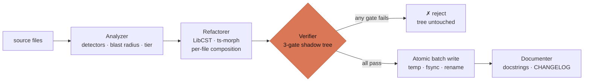
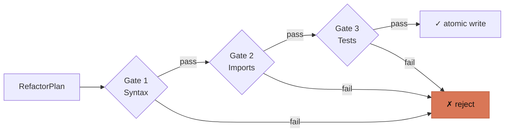

<p align="center">
  
</p>

# Refactron

[](https://github.com/Refactron-ai/Refactron_Lib_TS/actions/workflows/ci.yml)

**A deterministic refactoring engine for Python and TypeScript that proves the rewrite is safe before writing.** Every planned change runs against your own test suite in a shadow tree first; if a single test fails, nothing lands on disk.

Run `refactron analyze` to see what's rewriteable; `run --dry-run` for the diff; `run --apply` to commit it through three verification gates — syntax, imports, your tests — and an atomic batch write. No LLM in the path. No partial writes. Every refusal carries a precondition explaining itself.

**Jump to:** [Quickstart](#quickstart) · [How it works](#how-it-works) · [Architecture](#architecture) · [Configuration](#configuration) · [Status](#status--scope) · [Docs](#docs)

---

## Quickstart

Requires Node.js ≥ 18 and (for Python projects) Python ≥ 3.8.

```bash
npm install -g refactron@0.2.3
cd your-project
refactron analyze .            # findings + blast radius + tier
refactron run --dry-run        # preview the diff (no writes)
refactron run --apply          # 3 gates, then atomic write
```

Scope a run if you don't want every transform at once:

```bash
refactron run --apply --transforms=super_no_args,pep585_generics
refactron run --apply --files='src/legacy/**'
```

Also available as a PyPI wrapper: `pip install refactron`.

---

## How it works

| Piece             | What it is                                                                                                                                                                 |
| ----------------- | -------------------------------------------------------------------------------------------------------------------------------------------------------------------------- |
| **Analyzer**      | Tree-sitter / ts-morph detectors. Reports findings with blast radius and tier (debt / modernization / style).                                                              |
| **Refactorer**    | LibCST sidecars (Python) and ts-morph transforms (TypeScript) composed per file. Emits a `RefactorPlan` of file changes plus a `precondition` for every refusal.           |
| **Verifier**      | Three gates against a shadow tree: syntax → imports → tests. Depth scales with blast radius — a one-character edit runs syntax only; a multi-file refactor runs all three. |
| **Atomic writer** | Temp → fsync → rename, all-or-nothing per batch. Partial failure rolls back; your working tree is never half-written.                                                      |

All four engines compose around the locked adapter interface in `src/adapters/interface.ts` — adding a language is "implement `ILanguageAdapter`," not "fork the engine."

20 deterministic transforms ship today: 6 debt, 9 modernization, 5 style — full list in [`docs/transforms/`](docs/transforms/).

---

## Architecture

The pipeline a refactor flows through:



The three verification gates, in order:



A trivial whitespace edit runs only Gate 1; a critical-blast-radius change runs all three with a 120-second test timeout. Verification depth follows the change's reach.

Full design: [`ARCHITECTURE.md`](./ARCHITECTURE.md). Vocabulary: [`GLOSSARY.md`](./GLOSSARY.md). ADRs: [`dev-docs/decisions/`](./dev-docs/decisions/).

---

## Configuration

`refactron.yaml` at your project root. Every key is optional.

| Key             | Default  | Purpose                                                         |
| --------------- | -------- | --------------------------------------------------------------- |
| `transforms`    | all      | Subset of transform ids to run                                  |
| `confidence`    | `low`    | Minimum finding confidence (`low` / `medium` / `high`)          |
| `pythonVersion` | `"3.11"` | Drives PEP version-gated transforms (585, 604, etc.)            |
| `testCmd`       | auto     | Override the test command (auto-detects pytest / vitest / jest) |
| `exclude`       | —        | Globs to ignore beyond `.gitignore`                             |

Full schema in `src/core/config.ts`.

---

## Status & scope

**Built and shipped (v0.2.x, 739 tests):** the 4 engines, 20 transforms, 3-gate verification, atomic batch write, blast-radius scoring, tier taxonomy, precondition discipline, `.refactron/` session store, Ink TUI, JSON output, CLI flag scoping (`--transforms`, `--files`). Validated end-to-end on Ansible (4,465 files, ~100k LOC).

**Deliberately not built:**

- **No LLM in the refactor path.** The documenter is the only LLM consumer; it operates on already-verified, already-written code.
- **No network calls** from sidecars or the core engine.
- **No self-apply on this repo.** The fixtures under `fixtures/python-legacy-mini/` and `fixtures/ts-legacy-mini/` are deliberately full of legacy patterns; refactoring them invalidates the meta-tests, the test gate catches that, and the write is refused. Exclude `fixtures/**` in `refactron.yaml` to self-analyze.
- **No Ruby / Go / Rust adapters yet** — adapter interface is locked; adding one is a follow-on.
- **No public custom-transform API yet** — targeted for v0.3.

**Coming:** v0.3 — catalog refresh, expanded `manual_typecheck_to_hints` coverage, custom-transform API. v0.4 — Go adapter (demand-gated). v1.0 — once external usage has characterized the real bug surface.

---

## Docs

- [`ARCHITECTURE.md`](./ARCHITECTURE.md) — engines, locked surfaces, pipeline, invariants
- [`GLOSSARY.md`](./GLOSSARY.md) — blast radius, tier, sidecar, precondition, gate
- [`RUNBOOK.md`](./RUNBOOK.md) — release, rollback, CVE response
- [`CLAUDE.md`](./CLAUDE.md) — agent working rules + ops scaffolding
- [`CONTRIBUTING.md`](./CONTRIBUTING.md) — development workflow
- [`docs/`](./docs/) — full user docs (also at [docs.refactron.dev](https://docs.refactron.dev))

Security findings: do not open a public issue. Email `security@refactron.dev`.

---

## License

[Apache License 2.0](./LICENSE). See [`LICENSE`](./LICENSE) and [`NOTICE`](./NOTICE).
