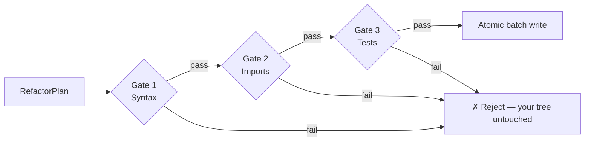

# Refactron

> Deterministic refactoring for Python and TypeScript that verifies every change against your tests before writing a single byte.

[](https://www.npmjs.com/package/refactron)
[](https://www.npmjs.com/package/refactron)
[](https://nodejs.org)
[](./LICENSE)
[](https://github.com/Refactron-ai/Refactron_Lib_TS/actions/workflows/ci.yml)


---

## At a glance

- **What it is** — a CLI that detects legacy patterns, rewrites them via AST-level transforms, and proves the rewrite is safe before touching disk.
- **Why it matters** — every other "AI refactor" tool produces a diff and asks you to trust it. Refactron produces a diff _and runs your tests against it in a shadow tree_ before committing to the write. If a single test fails, nothing lands.
- **For whom** — engineers maintaining real codebases who want to take down technical debt without spending a Tuesday afternoon reviewing 200-file diffs that turn out to be broken.

---

## Table of contents

- [The differentiator: 3-gate verification](#the-differentiator-3-gate-verification)
- [Install & first refactor](#install--first-refactor)
- [Example: before & after](#example-before--after)
- [Transforms by tier](#transforms-by-tier)
- [Configuration](#configuration)
- [Architecture](#architecture)
- [Performance](#performance)
- [What it does NOT do](#what-it-does-not-do)
- [Status & roadmap](#status--roadmap)
- [Documentation](#documentation)
- [Contributing](#contributing)
- [License](#license)

---

## The differentiator: 3-gate verification



Every planned change passes three gates **in a shadow tree** before any byte hits your working directory:

| Gate           | Checks                                                        | Failure mode            |
| -------------- | ------------------------------------------------------------- | ----------------------- |
| 1. **Syntax**  | The new content re-parses cleanly in the target language      | Reject; nothing written |
| 2. **Imports** | All `import` / `from` statements still resolve                | Reject; nothing written |
| 3. **Tests**   | Your project's full test suite passes against the shadow tree | Reject; nothing written |

Verification scales by **blast radius** — a trivial whitespace-only edit runs only the syntax gate; a multi-file refactor with cross-module impact runs all three with a 120-second timeout.

If all gates pass, the writer commits the batch **atomically**: every file's temp is fsync'd, then renamed in order. Partial failures roll back; your working tree is never in a half-written state.

See `ARCHITECTURE.md` for the engine internals and `docs/concepts/safety-model.mdx` for the full breakdown.

---

## Install & first refactor

```bash
npm install -g refactron@0.2.3
cd your-project
refactron analyze .            # report findings + blast radius + tier
refactron run --dry-run        # preview the diff (no writes)
refactron run --apply          # verify the 3 gates, then write atomically
```

Also available via PyPI as a thin wrapper: `pip install refactron`.

**Scope the change** if you don't want every transform at once:

```bash
refactron run --apply --transforms=super_no_args,pep585_generics
refactron run --apply --files='src/legacy/**'
```

---

## Example: before & after

A typical Python file before:

```python
class Greeter:
    def __init__(self, name):
        super(Greeter, self).__init__()         # super_no_args
        self.name = name

    def greet(self):
        return "Hello %s" % self.name           # format_to_fstring


@functools.lru_cache(maxsize=None)              # lru_cache_to_cache
def expensive(x):
    return x * x
```

After `refactron run --apply`:

```python
class Greeter:
    def __init__(self, name):
        super().__init__()
        self.name = name

    def greet(self):
        return f"Hello {self.name}"


@functools.cache
def expensive(x):
    return x * x
```

Three transforms composed in a single pass. Tests ran in the shadow tree. Atomic write. No partial state.

---

## Transforms by tier

Refactron classifies transforms by intent so you can scope your refactor by _what kind_ of change you want — not just by file path.

### Debt (6)

Real maintenance burden with a forward-looking argument. Worth a dedicated PR.

| Transform                                                                          | Language   | What it does                                                                                            |
| ---------------------------------------------------------------------------------- | ---------- | ------------------------------------------------------------------------------------------------------- |
| [`super_no_args`](docs/transforms/super-no-args.mdx)                               | Python     | Drops `Class, self` from `super()` — the Py2 form bakes in the class name and silently breaks on rename |
| [`pep585_generics`](docs/transforms/pep585-generics.mdx)                           | Python     | `typing.List` → `list` (PEP 585; `typing.*` generics on the deprecation timer)                          |
| [`var_to_const_let`](docs/transforms/var-to-const-let.mdx)                         | TypeScript | `var` → `const`/`let` — `var`'s function scoping is a documented bug source                             |
| [`implicit_any`](docs/transforms/implicit-any.mdx)                                 | TypeScript | Annotate untyped parameters when call-site inference is single-typed                                    |
| [`commonjs_to_esm`](docs/transforms/commonjs-to-esm.mdx)                           | TypeScript | CJS `require`/`module.exports` → ESM `import`/`export`                                                  |
| [`vue_set_delete_to_assignment`](docs/transforms/vue-set-delete-to-assignment.mdx) | TypeScript | `Vue.set`/`this.$set` → direct assignment (Vue 2 EOL'd Dec 2023)                                        |

### Modernization (9)

Newer form is clearly better; the old form still works. Worth doing opportunistically.

| Transform                                                                                  | Language   | What it does                                                                                         |
| ------------------------------------------------------------------------------------------ | ---------- | ---------------------------------------------------------------------------------------------------- |
| [`callback_to_async_await`](docs/transforms/callback-to-async-await.mdx)                   | Python     | Trailing-callback functions → async functions returning the result                                   |
| [`manual_typecheck_to_hints`](docs/transforms/manual-typecheck-to-hints.mdx)               | Python     | `isinstance`-chain dispatch → `Union[...]` parameter annotation                                      |
| [`deprecated_api_requests_to_httpx`](docs/transforms/deprecated-api-requests-to-httpx.mdx) | Python     | `requests` → `httpx` (modern equivalent; `requests` isn't deprecated, so this is migration not debt) |
| [`class_to_dataclass`](docs/transforms/class-to-dataclass.mdx)                             | Python     | Pure-data classes (trivial `__init__`) → `@dataclass`                                                |
| [`promise_chains_to_async`](docs/transforms/promise-chains-to-async.mdx)                   | TypeScript | `.then()` chains → async/await with named bindings per stage                                         |
| [`promise_constructor_to_async`](docs/transforms/promise-constructor-to-async.mdx)         | TypeScript | `new Promise((resolve) => resolve(value))` → async function                                          |
| [`lru_cache_to_cache`](docs/transforms/lru-cache-to-cache.mdx)                             | Python     | `@lru_cache(maxsize=None)` → `@cache` (Python ≥ 3.9)                                                 |
| [`indexof_to_includes`](docs/transforms/indexof-to-includes.mdx)                           | TypeScript | `arr.indexOf(x) !== -1` → `arr.includes(x)` (type-aware via ts-morph)                                |
| [`object_assign_to_spread`](docs/transforms/object-assign-to-spread.mdx)                   | TypeScript | `Object.assign({}, a, b)` → `{ ...a, ...b }`                                                         |
| [`yield_from_for_loop`](docs/transforms/yield-from-for-loop.mdx)                           | Python     | `for x in y: yield x` → `yield from y` (when loop has no other body)                                 |

### Style (5)

Semantically identical, pure preference. Worth running only on files you're already touching.

| Transform                                                                                    | Language   | What it does                                                    |
| -------------------------------------------------------------------------------------------- | ---------- | --------------------------------------------------------------- |
| [`format_to_fstring`](docs/transforms/format-to-fstring.mdx)                                 | Python     | `%`-formatting and `.format()` → f-strings                      |
| [`pep604_optional_union`](docs/transforms/pep604-optional-union.mdx)                         | Python     | `Optional[X]` → `X \| None`, `Union[A, B]` → `A \| B` (PEP 604) |
| [`datetime_utc_alias`](docs/transforms/datetime-utc-alias.mdx)                               | Python     | `datetime.timezone.utc` → `datetime.UTC` (Python ≥ 3.11)        |
| [`string_concat_to_template_literal`](docs/transforms/string-concat-to-template-literal.mdx) | TypeScript | `'Hello ' + name + '!'` → `` `Hello ${name}!` ``                |

The `analyze` output groups findings + minutes by tier so you can read "57 debt items (315 min), 102 modernization (490 min), 2,569 style (4,483 min)" instead of one undifferentiated count.

---

## Configuration

`refactron.yaml` at your project root. Every key is optional; the defaults are sensible.

```yaml
# Which transforms to run. Default: all.
transforms:
  - super_no_args
  - pep585_generics
  - format_to_fstring

# Minimum confidence to surface a finding. Default: low.
confidence: medium # one of: low, medium, high

# Target Python version. Drives PEP version-gated transforms.
pythonVersion: '3.11'

# Test command override. Default: auto-detect pytest/vitest/jest.
testCmd: 'pytest -x -q'

# Files to ignore in addition to .gitignore.
exclude:
  - 'fixtures/**'
  - '**/migrations/**'
```

Full schema: `src/core/config.ts` and `docs/configuration.mdx`.

---

## Architecture

```
   source files
        ↓
   Adapter Registry   →  Python (LibCST sidecars) | TypeScript (ts-morph)
        ↓
   Analyzer            →  detectors + blast-radius + tier classification
        ↓ AnalysisReport
   Refactorer          →  composes transforms per file → RefactorPlan
        ↓
   Verifier            →  Gate 1: syntax / Gate 2: imports / Gate 3: tests
        ↓ (all gates pass)
   Atomic batch writer →  temp → fsync → rename, all-or-nothing
        ↓
   Documenter          →  docstrings (LLM, gated) + CHANGELOG entries
```

The four engines implement locked contracts in `src/contracts.ts` — they compose around the language-agnostic adapter interface in `src/adapters/interface.ts`. Adding a language is "implement `ILanguageAdapter`," not "fork the engine."

See `ARCHITECTURE.md` for the full picture and `dev-docs/decisions/` for the ADRs behind specific choices.

---

## Performance

Reproducible benchmark on Apple M2, Node 24:

| Tree size | Files | Median analyze | Range           |
| --------- | ----- | -------------- | --------------- |
| 10k LOC   | 448   | 1.31s          | 1.16s – 1.64s   |
| 100k LOC  | 4,465 | 20.58s         | 14.99s – 38.65s |

Run it yourself: `bash bench/run-bench.sh`.

---

## What it does NOT do

- **No LLM in the refactor path.** Documentation generation is the only LLM consumer, and it operates on already-verified, already-written code.
- **No network calls** from sidecars or the core engine.
- **No partial writes.** A failed batch leaves the working tree exactly as it was.
- **No silent refusals** (post v0.2.4). Every transform that can't rewrite a file emits a `precondition` record explaining why.
- **No Ruby / Go / Rust adapters yet.** Adding one requires implementing `ILanguageAdapter`; the engine itself is language-agnostic.
- **No public extension API for custom transforms yet.** Targeted for the v0.3 catalog refresh.
- **No self-apply on the Refactron repo.** Running `refactron run --apply` on this repo will fail the test gate by design — the fixtures under `fixtures/python-legacy-mini/` and `fixtures/ts-legacy-mini/` are deliberately full of legacy patterns; refactoring them invalidates the meta-tests, the gate catches that, and the write is refused. Exclude `fixtures/**` in `refactron.yaml` to self-analyze.

---

## Status & roadmap

**Current**: v0.2.x — production-suitable for the 20 shipped transforms on TypeScript and Python codebases. Validated end-to-end on Ansible (4,465 files / ~100k LOC).

**Coming**:

- v0.3 — transform-catalog refresh: renames, deprecation cycles, expanded `manual_typecheck_to_hints` coverage, public custom-transform API surface.
- v0.4 — Go adapter (subject to demand).
- v1.0 — once the bug-report surface area from external usage has been characterized and addressed.

**Versioning**: SemVer. See `RUNBOOK.md` for the release process and `CHANGELOG.md` for what's shipped.

---

## Documentation

Full documentation: [docs.refactron.dev](https://docs.refactron.dev) (or [`docs/`](docs/) in this repo).

In this repository:

- [`ARCHITECTURE.md`](./ARCHITECTURE.md) — engines, locked surfaces, pipeline, invariants
- [`GLOSSARY.md`](./GLOSSARY.md) — blast radius, tier, sidecar, precondition, gate
- [`RUNBOOK.md`](./RUNBOOK.md) — release, rollback, CVE response
- [`CONTRIBUTING.md`](./CONTRIBUTING.md) — development workflow
- [`CODE_STYLE.md`](./CODE_STYLE.md) — concrete TS + Python rules
- [`COMMIT_CONVENTIONS.md`](./COMMIT_CONVENTIONS.md) — Conventional Commits scope vocabulary
- [`dev-docs/decisions/`](./dev-docs/decisions/) — Architecture Decision Records

---

## Citations

- Opdyke 1992 — _Refactoring Object-Oriented Frameworks_ (UIUC PhD thesis) — academic foundation for behavior-preserving refactoring
- Brunsfeld 2018 — _Tree-sitter: a new parsing system for programming tools_ (Strange Loop) — analysis layer
- Instagram engineering — [LibCST](https://github.com/Instagram/LibCST) — Python codemod foundation
- Microsoft / TypeScript team — [ts-morph](https://github.com/dsherret/ts-morph) — TypeScript AST transforms
- Wang et al. ICSE 2018 — _Towards Refactoring-Aware Regression Test Selection_ — coverage-of-changed-surface insight

---

## Contributing

See [`CONTRIBUTING.md`](./CONTRIBUTING.md). If you're using Claude Code, the senior subagents under `.claude/agents/` are wired for delegation — read [`CLAUDE.md`](./CLAUDE.md).

Security findings: **do not open a public issue.** Email `security@refactron.dev`. See [`SECURITY.md`](./SECURITY.md).

---

## License

Apache License 2.0 — see [LICENSE](./LICENSE) and [NOTICE](./NOTICE).

The Apache 2.0 license is permissive (use, modify, distribute, sublicense — including in commercial and proprietary projects) and includes an **explicit patent grant** from every contributor. See [`docs/faq.mdx#why-apache-20`](./docs/faq.mdx) for the rationale behind the choice.
