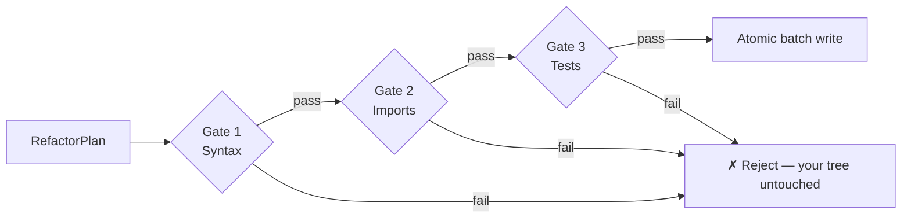

# Refactron

Refactron finds legacy patterns in your Python and TypeScript code, refactors them deterministically, and proves nothing broke before writing a single byte.

[](https://www.npmjs.com/package/refactron)
[](https://www.npmjs.com/package/refactron)
[](https://nodejs.org)
[](./LICENSE)
[](https://github.com/Refactron-ai/Refactron_Lib_TS/actions/workflows/ci.yml)


---

## Install + first refactor

```bash
npm install -g refactron@0.2.0
cd your-project && refactron login
refactron analyze .
refactron run --apply
```

Or via PyPI: `pip install refactron` (Python wrapper around the npm package).

---

## The 3-gate safety model



Every refactor passes three gates before any byte is written: (1) the new content re-parses cleanly; (2) all imports resolve; (3) your project's full test suite passes on a shadow tree. Atomic write or rollback — never partial state. See [`docs/concepts/safety-model.mdx`](docs/concepts/safety-model.mdx) for the full breakdown.

---

## Transform catalog

| Transform | Language | Description |
|---|---|---|
| [`callback_to_async_await`](docs/transforms/callback-to-async-await.mdx) | Python | Convert trailing-callback functions into async functions that return the result |
| [`format_to_fstring`](docs/transforms/format-to-fstring.mdx) | Python | Convert old-style `%`-formatting and `.format()` calls into f-strings |
| [`class_to_dataclass`](docs/transforms/class-to-dataclass.mdx) | Python | Promote pure data-holder classes (trivial `__init__`) to `@dataclass` |
| [`manual_typecheck_to_hints`](docs/transforms/manual-typecheck-to-hints.mdx) | Python | Promote `isinstance`-chain dispatch into a `Union[...]` annotation on the parameter |
| [`deprecated_api_requests_to_httpx`](docs/transforms/deprecated-api-requests-to-httpx.mdx) | Python | Migrate the `requests` library to the modern `httpx` equivalent |
| [`promise_chains_to_async`](docs/transforms/promise-chains-to-async.mdx) | TypeScript | Convert `.then()` chains into async/await with named bindings per stage |
| [`promise_constructor_to_async`](docs/transforms/promise-constructor-to-async.mdx) | TypeScript | Replace `new Promise((resolve) => resolve(value))` with an async function returning the value |
| [`var_to_const_let`](docs/transforms/var-to-const-let.mdx) | TypeScript | Replace `var` declarations with `const` (or `let` if reassigned) per binding |
| [`commonjs_to_esm`](docs/transforms/commonjs-to-esm.mdx) | TypeScript | Migrate CommonJS `require` / `module.exports` to ES module `import` / `export` |
| [`implicit_any`](docs/transforms/implicit-any.mdx) | TypeScript | Annotate untyped parameters when call-site inference yields a single primitive |

---

## Honest limitations

- Python and TypeScript only at v0.2; no Ruby/Go/Rust adapters yet.
- Documentation engine requires a reachable LLM provider (graceful skip otherwise — refactor still ships).
- Self-analysis on Refactron's own repo fails the test gate by design (mutating the bundled fixtures breaks meta-tests). See [Self-test paradox](#self-test-paradox) below.
- Public extension API for custom transforms is post-launch.
- Test gate is bound by your project's own suite — runs `npm test` / `pytest` in a shadow tree.

### Self-test paradox

If you `git clone` Refactron and run `refactron run --apply` on the repo itself, the test gate **will** fail and **no files will be written**. That's working as designed — the meta-tests exercise transforms on `fixtures/python-legacy-mini/` and `fixtures/ts-legacy-mini/`, which are deliberately full of legacy patterns. Refactoring them invalidates the tests' expected inputs, the verification engine catches the regression, and the write is refused — exactly what would happen on any project where a refactor breaks downstream tests.

To self-analyze without triggering this, exclude the fixtures via `.refactronrc.json`:

```json
{ "exclude": ["fixtures/**"] }
```

---

## Performance

Reproducible benchmark on Apple M2, Node 24:

| Tree size | Files | Median analyze | Range |
|---|---|---|---|
| 10k LOC | 448 | 1.31s | 1.16s – 1.64s |
| 100k LOC | 4,465 | 20.58s | 14.99s – 38.65s |

Run it yourself: `bash bench/run-bench.sh`.

---

## Documentation

Full documentation: [refactron.dev/docs](https://refactron.dev/docs) (or [`docs/`](docs/) in this repo).

---

## Citations

- Opdyke 1992 — *Refactoring Object-Oriented Frameworks* (UIUC PhD thesis) — academic foundation for behavior-preserving refactoring
- Brunsfeld 2018 — *Tree-sitter: a new parsing system for programming tools* (Strange Loop) — analysis layer
- Instagram engineering — [LibCST](https://github.com/Instagram/LibCST) — Python codemod foundation
- Microsoft / TypeScript team — [ts-morph](https://github.com/dsherret/ts-morph) — TypeScript AST transforms
- Wang et al. ICSE 2018 — *Towards Refactoring-Aware Regression Test Selection* — coverage-of-changed-surface insight

---

## Contributing

See [CONTRIBUTING.md](./CONTRIBUTING.md).

---

## Changelog

See [CHANGELOG.md](./CHANGELOG.md).

---

## License

MIT — see [LICENSE](./LICENSE).
