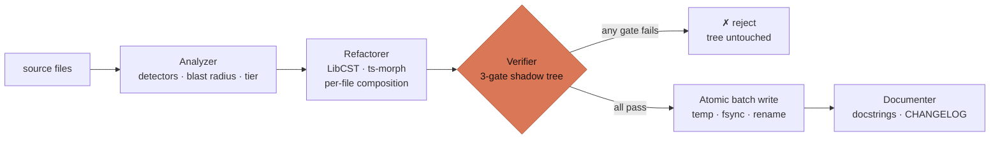
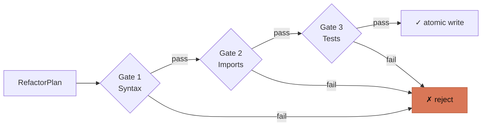

<p align="center">
  
</p>

# Refactron

[](https://github.com/Refactron-ai/Refactron_Lib_TS/actions/workflows/ci.yml)

**The verification layer for AI code change.** Prove that any change, your AI agent's, a codemod's, or your own, preserved behavior. Refactron applies the change in an isolated shadow tree, runs your real test suite, and returns a three-way verdict: `SAFE`, `UNSAFE`, or `UNPROVEN`. Your working tree is never touched.

It plugs in where change happens: a `verify-diff` CLI (and CI gate), and an MCP server your AI agent calls before it lands a change. No model decides whether your code is safe; the verdict is deterministic and reproducible.

**Jump to:** [Quickstart](#quickstart) · [The verdict](#the-verdict) · [MCP](#verify-from-your-agent-mcp) · [Migration mode](#migration-mode) · [Architecture](#architecture) · [Docs](#docs)

---

## Quickstart

Requires Node.js ≥ 18, and Python 3.8+ with `coverage.py` for Python coverage.

```bash
npm install -g refactron@0.3.0
```

That puts two binaries on your `PATH`: `refactron` (the CLI) and `refactron-mcp` (the MCP server). To skip the install, run `npx refactron@0.3.0 <command>` instead.

Authenticate once (`refactron login`, or `REFACTRON_TOKEN` in CI; unauthenticated exits `7`), then verify a diff:

```bash
git diff > change.diff        # or: your agent wrote change.diff
refactron verify-diff . --diff change.diff --test-cmd "python3 -m pytest -q"
```

```text
[UNPROVEN] Tests pass, but the changed code is not exercised by any test.
  uncovered: calc.py:14
```

Refactron copies the repo into an isolated shadow tree, applies the diff there, runs the gates, and measures whether your tests exercise the changed lines. Your real tree is never modified. Add `--json` for the full reproducible report.

### Installing from PyPI

`pip install refactron==0.3.0` installs a thin `refactron` shim that shells out to the npm CLI. It is not a Node-free path: you still need Node.js ≥ 18 **and** the npm package (`npm install -g refactron@0.3.0`). If the npm CLI is missing, the shim prints the exact matching install command and exits non-zero rather than installing anything for you. The shim provides the `refactron` command only; `refactron-mcp` comes from the npm package.

### Build from source (contributors)

```bash
git clone https://github.com/Refactron-ai/Refactron_Lib_TS
cd Refactron_Lib_TS
npm install
npm run build
```

The CLI is then `node dist/cli/index.js <command>` and the MCP server is `node dist/mcp/server.js`. Use the published binaries above unless you are working on Refactron itself.

---

## The verdict

| Verdict    | Meaning                                                                                              | Exit |
| ---------- | ---------------------------------------------------------------------------------------------------- | ---- |
| `SAFE`     | Every gate passed **and** your tests exercise the changed code (at least one changed line per file). | `0`  |
| `UNSAFE`   | A gate failed: the change broke something.                                                           | `1`  |
| `UNPROVEN` | Tests pass, but the changed code isn't exercised (or coverage couldn't be assessed).                 | `0`  |

`UNPROVEN` is the honest verdict. "Tests pass" is not "proven safe": if nothing runs the lines you changed, a green suite proves nothing about them. Refactron says so, and (for Python) names the line to add a test for.

Coverage is **Python-only** (via `coverage.py`), so a TypeScript or mixed-language diff can never earn `SAFE` today; it returns `UNPROVEN` ("coverage of the changed code could not be determined"). The gates still run; only the coverage half is Python-only.

---

## Verify from your agent (MCP)

Refactron ships a stdio [MCP](https://modelcontextprotocol.io) server exposing one tool, `verify_change`, so an AI agent can verify a change before it lands it. For Claude Code:

```bash
claude mcp add refactron -- refactron-mcp
```

`refactron-mcp` is installed by `npm install -g refactron@0.3.0`. Working from a source checkout instead? Point the client at `node /absolute/path/to/Refactron_Lib_TS/dist/mcp/server.js`.

The agent proposes an edit (full-file `edits` or a `unifiedDiff`), calls `verify_change`, and gets back the same `SAFE` / `UNSAFE` / `UNPROVEN` JSON report, then decides whether to land it. The tool runs entirely local and never mutates your repo.

---

## Migration mode

Refactron also ships 20 deterministic AST transforms (Python via LibCST, TypeScript via ts-morph) that both _author_ a mechanical change and _verify_ it through the same gates before an atomic write. Same package, same install:

```bash
npm install -g refactron@0.3.0
cd your-project && refactron login
refactron analyze .            # findings + blast radius + tier
refactron run --dry-run        # preview the diff (no writes)
refactron run --apply          # gates, then atomic write
```

Full catalog and reference: [`docs/transforms/`](docs/transforms/) · [docs.refactron.dev](https://docs.refactron.dev).

---

## How it works

The verification engine is the shared core: an isolated shadow tree, three gates, and a coverage check.

| Piece             | What it is                                                                                                                                                                                |
| ----------------- | ----------------------------------------------------------------------------------------------------------------------------------------------------------------------------------------- |
| **Verifier**      | Three gates against a shadow tree: syntax → imports → tests, then changed-line coverage. Fuses into the `SAFE` / `UNSAFE` / `UNPROVEN` verdict. The core `verify-diff` and MCP both call. |
| **Atomic writer** | Temp → fsync → rename, all-or-nothing per batch. Migration mode only; `verify-diff` never writes. Partial failure rolls back; your tree is never half-written.                            |
| **Analyzer**      | Tree-sitter / ts-morph detectors (migration mode). Reports findings with blast radius and tier (debt / modernization / style).                                                            |
| **Refactorer**    | LibCST sidecars (Python) and ts-morph transforms (TypeScript), composed per file (migration mode). Emits a `RefactorPlan` plus a `precondition` for every refusal.                        |

All of it composes around the locked adapter interface in `src/adapters/interface.ts`: adding a language is "implement `ILanguageAdapter`," not "fork the engine."

---

## Architecture

The pipeline a migration-mode change flows through (`verify-diff` reuses the Verifier and stops at the verdict, no write):



The three verification gates, in order:



Every change runs all three gates in order (syntax, then imports, then your full test suite); no gate is skipped. The test gate's default timeout is 600 seconds (10 minutes). (Refactron's legacy blast-radius engine scaled check selection and timeouts by a change's reach; the `verify-diff` and MCP path applies the flat default.)

Full design: [`ARCHITECTURE.md`](./ARCHITECTURE.md). Vocabulary: [`GLOSSARY.md`](./GLOSSARY.md). ADRs: [`dev-docs/decisions/`](./dev-docs/decisions/).

---

## Configuration

`refactron.yaml` at your project root. Every key is optional.

| Key             | Default  | Purpose                                                         |
| --------------- | -------- | --------------------------------------------------------------- |
| `transforms`    | all      | Subset of transform ids to run                                  |
| `confidence`    | `low`    | Minimum finding confidence (`low` / `medium` / `high`)          |
| `pythonVersion` | `"3.11"` | Drives PEP version-gated transforms (585, 604, etc.)            |
| `testCmd`       | auto     | Override the test command (auto-detects pytest / vitest / jest) |
| `exclude`       | none     | Globs to ignore beyond `.gitignore`                             |

Full schema in `src/core/config.ts`.

---

## Status & scope

`refactron@0.3.0` on npm ships both surfaces from one package, as the `refactron` and `refactron-mcp` bins.

**Verification layer:** `verify-diff` for an arbitrary diff, the MCP `verify_change` tool, the three-way `SAFE` / `UNSAFE` / `UNPROVEN` verdict with changed-line coverage fusion, and `preflight` (a coverage-aware SQLAlchemy 1.x → 2.0 safety report).

**Migration mode:** the 4 engines, 20 transforms, 3-gate verification, atomic batch write, blast-radius scoring, tier taxonomy, precondition discipline, `.refactron/` session store, Ink TUI, JSON output, CLI flag scoping (`--transforms`, `--files`). Validated end-to-end on Ansible (4,465 files, ~100k LOC).

**Deliberately not built:**

- **No model in the verification path.** The verdict is deterministic and reproducible. The only LLM consumer is the migration-mode documenter, on already-verified, already-written code.
- **No network calls** from the verification engine: it runs entirely local.
- **Coverage is Python-only** (via `coverage.py`), so a non-Python or mixed diff returns `UNPROVEN`, never a false `SAFE`.
- **No Ruby / Go / Rust adapters yet**: adapter interface is locked; adding one is a follow-on.

**Roadmap:** fleet verification across many repos and audit history are the paid tier; v1.0 lands once external usage has characterized the real bug surface.

---

## Docs

- [`ARCHITECTURE.md`](./ARCHITECTURE.md): engines, locked surfaces, pipeline, invariants
- [`GLOSSARY.md`](./GLOSSARY.md): blast radius, tier, sidecar, precondition, gate
- [`RUNBOOK.md`](./RUNBOOK.md): release, rollback, CVE response
- [`CLAUDE.md`](./CLAUDE.md): agent working rules + ops scaffolding
- [`CONTRIBUTING.md`](./CONTRIBUTING.md): development workflow
- [`docs/`](./docs/): full user docs (also at [docs.refactron.dev](https://docs.refactron.dev))

Security findings: do not open a public issue. Email `security@refactron.dev`.

---

## License

[Apache License 2.0](./LICENSE). See [`LICENSE`](./LICENSE) and [`NOTICE`](./NOTICE).
