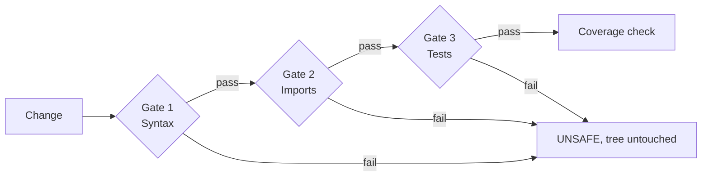

Refactron's value is what happens **before** you trust a change, not how clever any rewrite is. Every change (an arbitrary diff you're [verifying](/verification/verify-diff), or a [migration-mode transform](/transforms) landing atomically) passes through the same engine: an isolated shadow tree, three gates, and a coverage check that fuses into one verdict.

> **Inviolable rule:** verification runs against a copy, never your working tree. When Refactron does write (migration mode), it writes atomically.

## The shadow tree

Nothing in the gate path reads or writes your real working tree. Refactron builds a **shadow tree** first: a temp-directory copy of the project root where unchanged files are hardlinked (cheap, instant) and the changed files are written from the proposed new content.

<Frame caption="The change is applied to an isolated copy. Your working tree is never touched.">
  
</Frame>

For [`verify-diff`](/verification/verify-diff) and the [MCP `verify_change` tool](/verification/mcp-server), this is the whole story: the shadow tree is built, the gates run, the verdict is returned, and the copy is cleaned up. **Your repo is never mutated.** Landing the change is the caller's decision.

## The three gates

### Gate 1: Syntax

Re-parse the new content for each changed file.

- **Python:** LibCST parses the proposed source. A failure means a malformed change slipped through.
- **TypeScript:** ts-morph collects diagnostics; any `Error`-category diagnostic rejects the file.

If any file fails to parse, the gate rejects with a `blockingReason` naming the offending file. Typical wall-clock: ~50ms for a small change.

### Gate 2: Imports

Build a dependency graph from the proposed content and resolve every import.

- **Python:** collect `import X` and `from X import Y`; resolve against `sys.path` plus the project tree.
- **TypeScript:** ts-morph `getImportDeclarations()` plus `getModuleSpecifierSourceFile()`.

**Reject conditions:**

- A newly-introduced import doesn't resolve.
- An import that previously resolved in a changed file now fails (e.g. the change deleted a re-exported symbol).

This catches the most common breakage: the change is locally valid but quietly orphans a downstream module. Typical wall-clock: ~50ms.

### Gate 3: Tests

The most expensive gate, and the only one that runs **your** code.

1. **Detect the test runner** from a config file in the project root:
   - `vitest.config.{ts,js,mjs}` → `vitest run`
   - `jest.config.{ts,js,cjs,json}` → `jest`
   - `pyproject.toml` with `[tool.pytest.*]` or `pytest.ini` → `pytest`
   - Override with `--test-cmd` (CLI / MCP) or `.refactronrc.json` `testCmd`.
2. **Run the baseline first**: the runner against the _unchanged_ copy. If the baseline already fails, Refactron won't blame the change: the tests gate reports an already-red baseline, and the verdict becomes [`UNPROVEN`](/verification/verdicts), not `UNSAFE`.
3. **Run the mutated tree**: same runner, with the change in place. A non-zero exit fails the gate.

The test-gate timeout scales with the change's blast radius: 45s for a standard change, 120s for a critical one. Wall-clock is otherwise dominated by your own suite.

## Coverage fusion → the verdict

Passing the gates is necessary but not sufficient. A green suite says nothing about lines your tests never run. So when the gates pass, Refactron measures **changed-line coverage** and fuses the two signals into one verdict:

| Gates         | Changed lines exercised? | Verdict    |
| ------------- | ------------------------ | ---------- |
| A gate failed | n/a                      | `UNSAFE`   |
| All passed    | yes                      | `SAFE`     |
| All passed    | no, or couldn't tell     | `UNPROVEN` |

Coverage is measured with `coverage.py`, so it is **Python-only** today. A non-Python or mixed diff passes the gates but returns `UNPROVEN` ("coverage could not be determined"); Refactron never reports an unmeasured change as `SAFE`. The full rules, including the `missingTests` hints, are on the [Verdicts](/verification/verdicts) page.

## Atomic batch write (landing)

`verify-diff` never writes. **Migration mode** does, and only on green. Once the gates pass, the verifier hands a list of `(path, newContent)` pairs to `writeBatchAtomic`, using `write-file-atomic` per file:

1. Write the new content to a sibling temp file (`<path>.refactron-tmp-<rand>`).
2. `fsync` the temp file.
3. POSIX `rename` (`MoveFileExW` on Windows) the temp over the real path: atomic at the filesystem layer.

**The contract:** either every change lands, or none does. There is no intermediate state where one file has new content and another still holds the old. A mid-batch failure aborts and cleans up the temp files; your real tree never sees the inconsistent middle.

## Cross-file preconditions (migration mode)

Some transforms need to know whether **other files** depend on the surface they're about to mutate. These walk the import graph for the target file and skip themselves rather than break a cross-file caller:

- [`callback_to_async_await`](/transforms/callback-to-async-await): skips when an external file imports the function and passes a callback at the call site.
- [`deprecated_api_requests_to_httpx`](/transforms/deprecated-api-requests-to-httpx): skips when an external file references `<module>.requests` (including `unittest.mock.patch` string targets).

The check runs during planning, before Gate 1, so the transform never produces a plan it knows would orphan a caller.

## Citations

The gate-before-transform model traces back to Bill Opdyke's 1992 PhD thesis on behaviour-preserving refactoring at UIUC: the original formal treatment of preconditions before automated source transformation.

- Opdyke, William F. _Refactoring Object-Oriented Frameworks._ PhD thesis, University of Illinois at Urbana-Champaign, 1992. [PDF](https://www.cs.umd.edu/users/atif/Refactoring.pdf)
