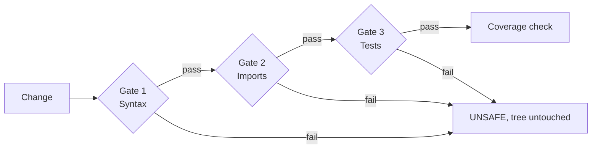

Refactron's value is what happens **before** you trust a change, not how clever any rewrite is. Every change you [verify](/verification/verify-diff) passes through the same engine: an isolated shadow tree, three gates, and a coverage check that fuses into one verdict.

> **Inviolable rule:** verification runs against a copy, never your working tree. Refactron never writes to it.

## The shadow tree

Nothing in the gate path reads or writes your real working tree. Refactron builds a **shadow tree** first: a temp-directory copy of the project root where unchanged files are hardlinked (cheap, instant) and the changed files are written from the proposed new content.

<Frame caption="The change is applied to an isolated copy. Your working tree is never touched.">
  
</Frame>

For [`verify-diff`](/verification/verify-diff) and the [MCP `verify_change` tool](/mcp/index), this is the whole story: the shadow tree is built, the gates run, the verdict is returned, and the copy is cleaned up. **Your repo is never mutated.** Landing the change is the caller's decision.

## The three gates

### Gate 1: Syntax

Re-parse the new content for each changed file.

- **Python:** LibCST parses the proposed source. A failure means a malformed change slipped through.
- **TypeScript:** ts-morph collects diagnostics; any `Error`-category diagnostic rejects the file.

If any file fails to parse, the gate rejects with a `blockingReason` naming the offending file. Typical wall-clock: ~50ms for a small change.

### Gate 2: Imports

Resolve every import in the changed files, and reject only the ones the change is actually responsible for.

- **Python:** collect `import X` and `from X import Y` and resolve each top-level module against `sys.path` plus the project tree. Imports guarded by `if TYPE_CHECKING:` are skipped, because they never run at runtime; a type-only dependency that is not installed is not a runtime break. Relative imports are left to the tests gate.
- **TypeScript:** resolve every import specifier against the project's `tsconfig.json`. Node builtins always count as resolved.

**Delta-aware.** The gate resolves imports in both the base file (your real tree) and the changed file (the shadow tree), then fails only on imports that are unresolvable in the changed file but were fine in the base file. An import that was already broken before your change is the repo's pre-existing state, not something the change introduced, so it never fails the gate. A brand-new file has an empty baseline, so every unresolvable import in it counts.

**Reject conditions:**

- The change adds an import that does not resolve.
- The change breaks an import that resolved before (for example, it deleted a re-exported symbol a changed file relied on).

One accepted limitation: an import you newly add that is guarded by a platform condition (say `import msvcrt`, which exists only on Windows) can still fail when the gate runs on another OS. The gate does not evaluate platform conditions, and stays conservative there.

This catches the most common breakage: the change is locally valid but quietly orphans a downstream module, without blaming your edit for imports the repo could never resolve in the first place. Typical wall-clock: ~50ms.

### Gate 3: Tests

The most expensive gate, and the only one that runs **your** code.

1. **Detect the test runner** by config-file _presence_ in the project root (no file contents are parsed):
   - `vitest.config.ts` or `vitest.config.js` → `vitest run`
   - `jest.config.js` or `jest.config.ts` → `jest`
   - any of `pyproject.toml`, `pytest.ini`, or `setup.cfg` present → `pytest`
   - Override with `--test-cmd` (CLI / MCP) or `.refactronrc.json` `testCmd`.
2. **Run the baseline first**: the runner against the _unchanged_ copy. If the baseline already fails, Refactron won't blame the change: the tests gate reports an already-red baseline, and the verdict becomes [`UNPROVEN`](/verification/verdicts), not `UNSAFE`.
3. **Run the mutated tree**: same runner, with the change in place. A non-zero exit fails the gate.

The test-gate timeout defaults to 600 seconds (10 minutes); wall-clock is otherwise dominated by your own suite. (Refactron's legacy blast-radius engine scaled this timeout by a change's reach; the `verify-diff` and MCP path applies the flat default.)

## Coverage fusion → the verdict

Passing the gates is necessary but not sufficient. A green suite says nothing about lines your tests never run. So when the gates pass, Refactron measures **changed-line coverage** and fuses the two signals into one verdict:

| Gates         | Changed lines exercised? | Verdict    |
| ------------- | ------------------------ | ---------- |
| A gate failed | n/a                      | `UNSAFE`   |
| All passed    | yes                      | `SAFE`     |
| All passed    | no, or couldn't tell     | `UNPROVEN` |

Coverage is measured with `coverage.py`, so it is **Python-only** today. A non-Python or mixed diff passes the gates but returns `UNPROVEN` ("coverage could not be determined"); Refactron never reports an unmeasured change as `SAFE`. The full rules, including the `missingTests` hints, are on the [Verdicts](/verification/verdicts) page.

## Atomic batch write (landing)

`verify-diff` never writes, and as of 0.4.0 nothing in Refactron does. Earlier versions had a migration mode that wrote on green, handing a list of `(path, newContent)` pairs to an atomic batch writer so a partial failure could never leave a half-written tree. That path was removed with the transforms; the guarantee it protected is now unconditional.

## Citations

The gate-before-transform model traces back to Bill Opdyke's 1992 PhD thesis on behaviour-preserving refactoring at UIUC: the original formal treatment of preconditions before automated source transformation.

- Opdyke, William F. _Refactoring Object-Oriented Frameworks._ PhD thesis, University of Illinois at Urbana-Champaign, 1992. [PDF](https://www.cs.umd.edu/users/atif/Refactoring.pdf)
